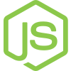
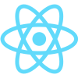
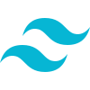
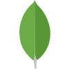
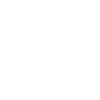
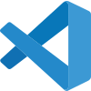

## Hi, I'm Noel Rafael Orphiano 👋

💻 Aspiring software and Ai engineer. 

🦊 Self-taught developer 

I'm a Computer Science student wanting to build cool applications.

🌱 Focused on learning Full-stack development and software engineering.

I'm currently working on [TM](https://github.com/noelorph/time-management-tracker) with spec-driven development

| **Currently Learning**  | **Goal**  |
| ----------------------- | --------- |
| Computer Science Fundamentals  | Learn the fundamentals |
| System Design  | Become a better engineer by learning how to design large-scale systems |
| DevOps tools  | Accelerate the delivery of high-performance applications by combining and automating the work of **software development**(Dev) and **IT Operations**(Ops) teams  |
| LLMs  | Learn how Large Language Models work. Integrate and implement AI to software applications  |
| AI tools  | Learn how to build with AI properly as an engineer |
| Spec-driven development  | To make the specification the source of truth for software development: instead of immediately writing code, developers first define the system’s intended behavior, requirements, constraints, and acceptance criteria, then implement and test the software against that specification. The goal is to reduce ambiguity and scope drift, improve alignment between stakeholders and developers (including AI coding agents), make changes more predictable, and provide a clear connection between requirements, implementation, and tests.  |

### Tech Stack:

</img>
</img>
</img>
</img>
</img>

</img>
</img>
</img>

</img>
</img>
</img>
</img>

</img>
</img>

**Focusing more on**:
- </img> Next.js
- </img> React
- </img> Supabase
- </img> Codex
- </img> TypeScript
<!--
**noelorph/noelorph** is a ✨ _special_ ✨ repository because its `README.md` (this file) appears on your GitHub profile.

Here are some ideas to get you started:

- 🔭 I’m currently working on ...
- 🌱 I’m currently learning ...
- 👯 I’m looking to collaborate on ...
- 🤔 I’m looking for help with ...
- 💬 Ask me about ...
- 📫 How to reach me: ...
- 😄 Pronouns: ...
- ⚡ Fun fact: ...
-->
